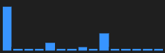
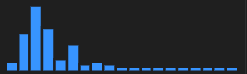

## Dataset Structure

Data source: [Kaggle Competition for STATS 202](https://www.kaggle.com/competitions/stats-202-kaggle-competition/)

The dataset is a CSV file with 9 columns and 90 rows. The columns are as follows: (Copied from)
| Column Name | Data Type | Example | Description |
| --- | --- | --- | --- |
| **ID** | Int | 1,2,3 | The county-given identification number for the selected plot |
| **YearBuilt** | Int | 1990,1986,1955 | The listed year in which the structure was built (by year) |
| **SqFt** | Int | 2102,1740,795 | The area of the floor plan in square feet (in square feet) |
| **Story** | Int/Ordered Categorical | 1.0,1.5,1.0 | How many stories the structure has (in stories) |
| **Acres** | Float | 0.77,0.6,0.30 | How many acres in included in the plot (in acres) |
| **Baths** | Discrete | 2,1,2.5 | The number of bathrooms at the residence (in bathrooms) |
| **Fireplaces** | Int | 1,0,2 | The number of fireplaces in the residence (in fireplaces) |
| **Zip** | Int | 61801,61802,61803 | The zip code of the property |
| **Value** | Int | 200000,150000,300000 | The total assessed value of the property (in dollars) |

## Basic Statistics

**Predictors**
- **YearBuilt** has a left-skewed distribution with one peak. 
- **SqFt** has a right-skewed distribution with one peak. 
- **Story** only takes on 3 values: 1.0, 1.5, and 2.0.  However, in test, only takes on 1.0 and 1.75(?) and 2.0.
- **Acres** has a outlier of 39. Plots below are the histogram without the outlier. 
- **Bath** has 1 missing value. 
- **Fireplaces** only take on 3 values: 0, 1, and 2. But 2 only occurs once. 
- **Zip** takes 26 unique values in train, and 9 in test. Test is a subset of train. 

**Target/Response**
- **Value** has a right-skewed distribution with one peak. One outlier. 

## Preprocessing

### Peliminary preprocess ideas
#### ID
Drop ID. It is a unique identifier for each row. It does not provide any information for the prediction.

#### YearBuilt
There are 3 values <= 1930. The range of YearBuilt in test is 1947-1995. But they may represent some subgroups.

#### SqFt
A row with highest SqFt got the highest Value.
